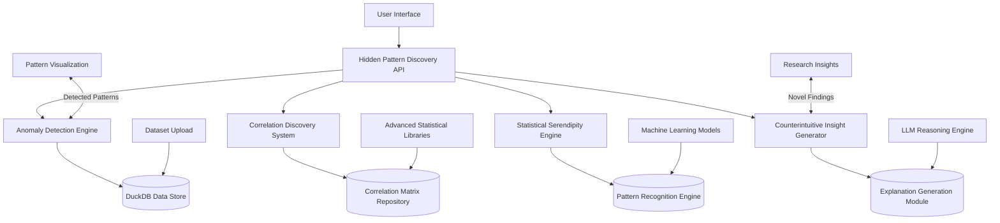

# Futuristic Analytics Feature Design: Hidden Pattern Discovery Engine

## 1. Overview

The Hidden Pattern Discovery Engine is a revolutionary feature that reveals statistical insights and relationships that would typically be overlooked by average researchers. This advanced AI system applies sophisticated algorithms to detect subtle patterns, hidden correlations, and unexpected findings in medical datasets that are virtually impossible to identify through conventional analysis approaches.

This system goes beyond current capabilities by:
- Automatically detecting subtle patterns invisible to traditional statistical methods
- Revealing hidden correlations between seemingly unrelated variables
- Identifying statistical anomalies that suggest novel research hypotheses
- Providing explanations for counterintuitive findings in medical data
- Offering serendipitous discoveries that can lead to breakthrough research insights

## 2. Architecture



## 3. Core Components

### 3.1 Anomaly Detection Engine

This component applies advanced statistical methods to identify outliers and anomalies in medical datasets that would typically be overlooked by researchers.

**Key Features:**
- Multivariate outlier detection using isolation forests
- Statistical anomaly identification using robust methods
- Rare event detection in large datasets
- Automatic flagging of potentially significant findings

### 3.2 Correlation Discovery System

Sophisticated system that uncovers hidden relationships between variables that are not apparent through standard correlation analysis.

**Key Features:**
- Non-linear correlation detection using mutual information
- Partial correlation analysis controlling for confounders
- Time-lagged relationship discovery
- Spurious correlation filtering to identify genuine relationships

### 3.3 Statistical Serendipity Engine

Machine learning system that identifies unexpected patterns and combinations of variables that suggest novel research directions.

**Key Features:**
- Association rule mining for unexpected variable combinations
- Clustering-based pattern discovery
- Subgroup analysis for hidden population segments
- Automatic hypothesis generation from detected patterns

### 3.4 Counterintuitive Insight Generator

AI-powered system that explains why certain findings might contradict conventional medical wisdom and suggests potential explanations.

**Key Features:**
- Contradiction detection with established medical knowledge
- Explanation generation using large language models
- Literature correlation for supporting evidence
- Research implication suggestions for discovered findings

## 4. API Endpoints

### 4.1 Pattern Discovery Trigger

```
POST /api/v1/discovery/analyze
{
  "dataset_id": "uuid",
  "discovery_depth": "comprehensive",
  "focus_areas": ["anomalies", "correlations", "subgroups"],
  "medical_context": "cardiovascular research"
}

Response:
{
  "discovery_session_id": "uuid",
  "status": "processing",
  "estimated_completion": "2023-06-15T14:30:00Z"
}
```

### 4.2 Hidden Pattern Retrieval

```
GET /api/v1/discovery/results/{discovery_session_id}

Response:
{
  "session_id": "uuid",
  "patterns_found": 23,
  "significant_findings": 7,
  "anomalies_detected": 15,
  "hidden_correlations": 8,
  "top_findings": [
    {
      "type": "counterintuitive_correlation",
      "variables": ["medication_a", "outcome_b"],
      "strength": 0.73,
      "p_value": 0.001,
      "medical_significance": "Contradicts previous literature"
    }
  ]
}
```

### 4.3 Insight Explanation

```
POST /api/v1/discovery/explain
{
  "finding_id": "uuid",
  "dataset_id": "uuid",
  "medical_context": "cardiology"
}

Response:
{
  "explanation": "This counterintuitive finding may be explained by..."
  "supporting_evidence": ["study_1", "study_2"],
  "research_implications": [
    "Consider investigating mechanism X",
    "Validate in prospective study"
  ],
  "confidence": 0.82
}
```

## 5. Data Models

### 5.1 Pattern Discovery Session Schema

```sql
CREATE TABLE discovery_sessions (
  session_id UUID PRIMARY KEY,
  dataset_id UUID,
  parameters JSONB,
  status VARCHAR(50),
  started_at TIMESTAMP,
  completed_at TIMESTAMP,
  patterns_found INTEGER
);

CREATE TABLE discovered_patterns (
  pattern_id UUID PRIMARY KEY,
  session_id UUID REFERENCES discovery_sessions(session_id),
  type VARCHAR(100),
  variables JSONB,
  strength DECIMAL(5,4),
  significance DECIMAL(5,4),
  description TEXT
);
```

### 5.2 Anomaly Detection Schema

```sql
CREATE TABLE detected_anomalies (
  anomaly_id UUID PRIMARY KEY,
  session_id UUID REFERENCES discovery_sessions(session_id),
  data_point_id VARCHAR(50),
  variables JSONB,
  deviation_score DECIMAL(5,4),
  medical_significance TEXT,
  detected_at TIMESTAMP
);
```

### 5.3 Hidden Correlation Schema

```sql
CREATE TABLE hidden_correlations (
  correlation_id UUID PRIMARY KEY,
  session_id UUID REFERENCES discovery_sessions(session_id),
  variable_a VARCHAR(100),
  variable_b VARCHAR(100),
  correlation_type VARCHAR(50),
  strength DECIMAL(5,4),
  p_value DECIMAL(5,4),
  explanation TEXT,
  discovered_at TIMESTAMP
);
```

## 6. Business Logic

### 6.1 Anomaly Detection Algorithm

1. Apply multiple statistical methods to identify outliers in uploaded dataset
2. Calculate anomaly scores using isolation forests and robust statistical methods
3. Filter anomalies based on medical significance thresholds
4. Cluster similar anomalies to identify patterns
5. Generate explanations for detected anomalies
6. Store anomaly metadata for further analysis

### 6.2 Hidden Correlation Discovery Pipeline

1. Compute linear and non-linear correlations between all variable pairs
2. Apply partial correlation analysis to control for confounding variables
3. Identify time-lagged relationships in longitudinal data
4. Filter spurious correlations using statistical validation
5. Rank correlations by strength and medical significance
6. Generate hypotheses for discovered relationships

### 6.3 Statistical Serendipity Engine

1. Apply association rule mining to identify unexpected variable combinations
2. Perform subgroup analysis to detect hidden population segments
3. Use clustering algorithms to identify natural groupings in data
4. Cross-reference findings with medical literature
5. Generate research implications for discovered patterns
6. Prioritize findings based on novelty and potential impact

### 6.4 Counterintuitive Insight Generation

1. Compare discovered patterns with established medical knowledge
2. Identify contradictions and anomalies in findings
3. Generate explanations using large language models
4. Validate explanations against medical literature
5. Create research recommendations for further investigation
6. Provide confidence scores for all generated insights

## 7. Implementation Roadmap

### Phase 1: Core Discovery Engine (Months 1-2)
- Implement anomaly detection algorithms with scikit-learn integration
- Build correlation discovery system with advanced statistical methods
- Create pattern recognition API endpoints
- Develop initial version of serendipity engine

### Phase 2: Advanced Pattern Recognition (Months 3-4)
- Enhance anomaly detection with isolation forests and robust statistics
- Implement non-linear correlation discovery methods
- Add subgroup analysis and clustering capabilities
- Improve counterintuitive insight generation

### Phase 3: Medical Intelligence Integration (Months 5-6)
- Integrate with medical literature databases
- Implement explanation generation using large language models
- Add collaborative research discovery features
- Develop publication-ready finding reporting capabilities

## 8. Security and Compliance

### 8.1 Data Protection
- End-to-end encryption for all uploaded datasets
- Role-based access control for research collaboration
- Audit logging for all discovery sessions and findings
- Automatic data anonymization for privacy protection

### 8.2 Research Integrity
- Reproducible discovery sessions with detailed logging
- Statistical validation of all reported findings
- Peer review integration for discovered insights
- Ethical AI guidelines for medical discovery

## 9. Performance Considerations

### 9.1 Scalability
- Parallel processing for large dataset analysis
- Distributed computing for complex pattern discovery
- Caching strategies for frequently accessed discovery results
- Database optimization for pattern storage and retrieval

### 9.2 Discovery Optimization
- Progressive discovery algorithms for real-time feedback
- Asynchronous processing for computationally intensive methods
- Memory optimization for large correlation matrices
- GPU acceleration for machine learning components

## 10. Testing Strategy

### 10.1 Unit Testing
- Test individual discovery algorithms with synthetic medical data
- Validate statistical correctness of anomaly detection methods
- Ensure proper error handling and edge case coverage
- Verify API contract compliance for discovery endpoints

### 10.2 Integration Testing
- Test end-to-end discovery workflows with real medical datasets
- Validate interoperability with existing analysis components
- Verify performance under load with stress testing
- Confirm security controls are properly implemented

### 10.3 Discovery Validation
- Collaborate with medical researchers for discovery accuracy
- Conduct validation studies on known hidden patterns
- Validate findings against peer-reviewed literature
- Obtain feedback from domain experts on discovered insights