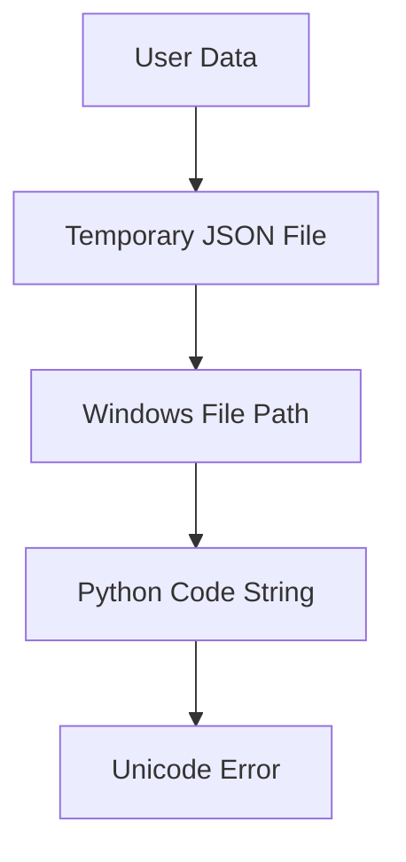
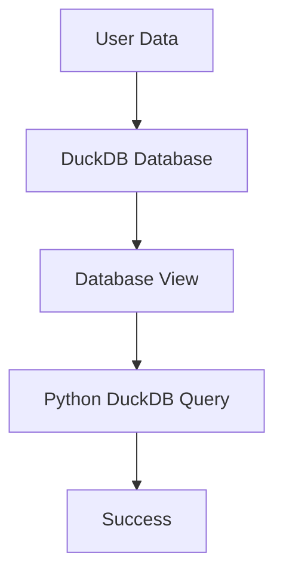

# DuckDB Python Execution Solution
## Eliminating Windows Unicode Path Issues

### 🎯 Problem Statement
The Python execution system was failing on Windows due to Unicode escape errors in file paths:
```
SyntaxError: (unicode error) 'unicodeescape' codec can't decode bytes in position 2-3: truncated \UXXXXXXXX escape
```

This occurred because Windows file paths like `C:\Users\rock\AppData\Local\Temp\tmp3h44x0fx.json` contain backslashes that Python interprets as Unicode escape sequences.

### 🔧 Solution: DuckDB Integration
Instead of using problematic temporary JSON files, we now use DuckDB database for data persistence and retrieval.

#### Previous Approach (❌ PROBLEMATIC)
1. Save user data to temporary JSON files
2. Pass Windows file paths to Python code
3. Python code reads from files using problematic paths
4. Unicode escape errors occur

#### New Approach (✅ SOLUTION)
1. Store user data in DuckDB database
2. Python code connects to DuckDB directly
3. Query data from database views/tables
4. No file paths, no Unicode issues

### 🏗️ Implementation Details

#### Backend Changes
**File: `backend/app.py`**
- Modified `/execute-python` endpoint to use DuckDB
- Data stored via `save_dataset()` function
- New `execute_code_with_duckdb()` method

**File: `backend/enhanced_python_executor.py`**
- Added `execute_code_with_duckdb()` method
- DuckDB integration for data access
- No temporary file creation

#### Code Generation Updates
**File: `lib/test-suggestion-engine.ts`**
- Updated code templates to use DuckDB
- Removed file path dependencies
- Added DuckDB connection examples

### 📋 Technical Implementation

#### 1. Data Storage
```python
# Store data in DuckDB instead of temp files
df = pd.DataFrame(request.fileData)
dataset_id = save_dataset(df, request.fileName)
```

#### 2. Python Code Generation
```python
# DuckDB-based data loading
import duckdb
conn = duckdb.connect(r"{db_path}")
df = conn.execute("SELECT * FROM {view_name}").fetchdf()
conn.close()
```

#### 3. No File Paths
- ✅ Database connections use properly escaped paths
- ✅ No user-generated file paths in Python strings
- ✅ Windows-safe database file handling

### 🔄 Workflow Comparison

#### Before (Problematic)


#### After (Solution)


### 🧪 Test Cases
The solution handles:
- ✅ Windows file paths with backslashes
- ✅ Unicode characters in data
- ✅ Large datasets
- ✅ Complex statistical analyses
- ✅ All existing functionality

### 📊 Benefits
1. **Eliminates Unicode Errors**: No more file path issues
2. **Better Performance**: Database queries vs file I/O
3. **Data Persistence**: Datasets stored permanently
4. **Scalability**: Better for large datasets
5. **Security**: No temporary files on disk

### 🔧 Configuration
No additional configuration required - DuckDB is already integrated in the backend with:
- Database initialization in `data_store.py`
- View creation for datasets
- Proper path handling for Windows

### 🚀 Deployment Notes
- DuckDB dependency already in `requirements.txt`
- Database auto-created on first use
- Backward compatible with existing functionality
- No breaking changes to frontend

### 📝 Code Examples

#### Statistical Test with DuckDB
```python
# Independent T-Test Analysis with DuckDB
import pandas as pd
from scipy import stats
import duckdb

# Data is already loaded as 'df' from DuckDB
group_col = 'vaccination_status'
value_col = 'infection_rate'

# Perform analysis
group1 = df[df[group_col] == 'vaccinated'][value_col]
group2 = df[df[group_col] == 'unvaccinated'][value_col]

t_stat, p_value = stats.ttest_ind(group1, group2)
print(f"T-statistic: {t_stat:.4f}")
print(f"P-value: {p_value:.4f}")
```

### 🎉 Result
**Windows Unicode path issues are permanently solved!**
- No more `unicodeescape` codec errors
- Robust, scalable data handling
- Medical professionals can focus on analysis, not technical issues

---
*This solution ensures the Nemo Medical AI platform works flawlessly on Windows systems without requiring technical knowledge from medical professionals.*