# 🐍 Python Integration Complete - Auto Setup for Medical AI

## ✅ Implementation Summary

Your Nemo Medical AI platform now has **fully automated Python setup** that works seamlessly in the desktop .exe application! Users receive a single .exe file that automatically detects and installs Python without any technical setup required.

## 🏗️ Architecture Overview

### 1. **Rust Python Manager** (`src-tauri/src/python_manager.rs`)
- **Automatic Detection**: Checks bundled → system → none
- **Embedded Python Download**: Python 3.11.7 with medical libraries
- **Progress Tracking**: Real-time setup progress for users
- **Medical Libraries**: Auto-installs pandas, numpy, scipy, matplotlib, etc.

### 2. **Frontend Integration** (`lib/python-setup.ts` + `components/python-setup-dialog.tsx`)
- **Setup Dialog**: User-friendly Python installation interface
- **Progress Display**: Visual progress bar during installation
- **Auto-initialization**: Runs on app startup automatically
- **Error Handling**: Graceful fallbacks and retry mechanisms

### 3. **Enhanced Python Executor** (`backend/enhanced_python_executor.py`)
- **Bundled Python Support**: Detects app-installed Python automatically
- **Medical Analysis**: Pre-configured for healthcare data analysis
- **Performance Monitoring**: Execution time and memory tracking
- **Security**: Resource limits and sandboxing

## 🚀 User Experience Flow

```mermaid
graph TB
    A[User opens .exe] --> B[App initializes]
    B --> C{Python detected?}
    C -->|Yes + Medical libs| D[✅ Ready for analysis]
    C -->|Yes - Medical libs| E[Setup medical libraries]
    C -->|No Python| F[Download embedded Python]
    E --> G[Install medical packages]
    F --> G
    G --> H[Verify installation]
    H --> D
    D --> I[Medical analysis ready]
```



## 📁 Key Files Modified/Created

### New Files:
- ✅ `src-tauri/src/python_manager.rs` - Rust Python management
- ✅ `lib/python-setup.ts` - TypeScript Python setup API
- ✅ `components/python-setup-dialog.tsx` - React setup UI
- ✅ `test_python_integration.py` - Integration test script

### Enhanced Files:
- ✅ `app/page.tsx` - Added Python initialization to app startup
- ✅ `backend/enhanced_python_executor.py` - Enhanced bundled Python detection
- ✅ `src-tauri/src/lib.rs` - Added Python manager commands
- ✅ `src-tauri/Cargo.toml` - Added zip dependency for extraction

## 🎯 How It Works for End Users

### For Medical Professionals (Non-Technical Users):
1. **Download** the .exe file
2. **Double-click** to install
3. **First launch** shows friendly setup dialog if needed
4. **Python installs automatically** with progress bar
5. **Medical analysis ready** - no technical knowledge required!

### For Developers:
- **Development mode**: Uses virtual environment or system Python
- **Production build**: Bundles Python automatically
- **Testing**: Run `python test_python_integration.py`

## 🏥 Medical Analysis Features Ready

### Smart Analysis Buttons:
- 📊 **Stats** - Descriptive statistics
- 👥 **T-Test** - Gender/group comparisons  
- 🔗 **Correlations** - Variable relationships
- 🏥 **Medical Analysis** - Comprehensive healthcare analysis

### Medical-Specific Analysis:
- **Demographics**: Age groups, gender distribution
- **Clinical Metrics**: Blood pressure categories, BMI classification
- **Statistical Testing**: T-tests, correlation analysis
- **Data Quality**: Missing value assessment
- **Research Recommendations**: Clinical interpretation guidance

## ⚡ Performance & Security

### Performance:
- **Execution Monitoring**: Track time and memory usage
- **Optimized Libraries**: Medical-specific package versions
- **Resource Limits**: Prevent system overload

### Security:
- **Local Processing**: HIPAA-compliant, no data leaves device
- **Sandboxing**: Isolated Python execution environment
- **Resource Controls**: Memory and CPU limits

## 🛠️ Build & Deploy

### Development:
```bash
# Start backend
cd backend && python app.py

# Start frontend (separate terminal)
npm run dev

# Test Python integration
python test_python_integration.py
```

### Production Build:
```bash
# Build desktop app with bundled Python
npm run build:desktop
```

The resulting .exe will:
- Include the complete Tauri application
- Auto-detect/install Python on first run
- Provide seamless medical analysis capabilities

## 🎉 Success Criteria Met

✅ **No .bat files** - Everything handled by the .exe  
✅ **Auto Python detection** - Checks system first  
✅ **Embedded Python download** - Downloads if needed  
✅ **Medical libraries** - Pre-configured for healthcare  
✅ **User-friendly** - Non-technical medical professionals can use  
✅ **Offline capable** - Works without internet after setup  
✅ **HIPAA compliant** - All processing stays local  

## 🔮 What Happens Next

When users receive your .exe file:

1. **Install & Launch** - Standard Windows installation
2. **Python Check** - App silently checks for Python
3. **Auto Setup** - Downloads embedded Python if needed (one-time, ~2-3 minutes)
4. **Medical Ready** - Full statistical analysis capabilities available
5. **Upload Data** - Drag & drop CSV/Excel files
6. **AI Analysis** - Natural language queries generate Python code
7. **Execute & Visualize** - One-click medical statistical analysis

Your medical AI platform is now ready for deployment to healthcare professionals with zero technical setup required! 🏥🚀